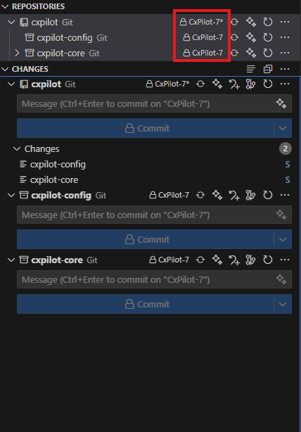

# CxPilot

This repo and its corresponding submodules contain Carbonix's customized
ArduPilot (both ArduPlane and AP_Periph), as well as any lua scripts and
parameter configurations.

## Repo Layout

- cxpilot: main integration glue and workflow host
- cxpilot-core: ArduPilot with minimal Carbonix patches and backports
- cxpilot-config: parameter and lua script management

## Getting Started

1. Check out the repo (within WSL if you are on Windows):

   ```bash
   git clone https://github.com/CarbonixUAV/cxpilot --recursive
   ```

2. Run the installer (if running WSL and/or VSCode)

   ```bash
   tools/setup/install-prereqs.sh
   ```

   This copies the example `launch.json` and `tasks.json` for VSCode, and adds
   the `wslhost` environment variable which is necessary for UDP links and
   RealFlight simulation in WSL.

3. Install VSCode workspace-recommended extensions

    In VSCode, hit `F1` and search for the `Extensions: Show Recommended
    Extensions` command. Install everything under the "Workspace
    Recommendations" heading. The "Tasks Shell Input" extension is particularly
    important for the launch/task profiles I include for building/debugging.

4. Reboot WSL and restart VSCode. If you are having trouble with UDP links or
   RealFlight simulation after this, a full system reboot is safer than just
   restarting WSL.

5. If you have not previously worked with ArduPilot, also run its environment
   setup:

   ```bash
   cd ../cxpilot-core/Tools/environment_install/
   ./install-prereqs-ubuntu.sh
   ```

   (Choose the variant matching your distro; skip if already done on stock
   ArduPilot or previous versions of CxPilot)

6. Manually check out the default development branch on each repository
   (`CxPilot-7` at time of writing, but that will soon change to `8`).

    

> [!CAUTION]
> Do not use `git submodule update` in the root `cxpilot` repo. The submodule
> pointers for `cxpilot-core` and `cxpilot-config` only update during a release,
> to avoid constant "update submodules" commits in the git log. Official
> releases can be uniquely identified by their `cxpilot` hash, and can be
> checked out using a recursive checkout, but dev builds in between releases
> cannot. You must manually check out each repo.

## Submitting Changes

First, be sure the default CxPilot development branch is checked out on all
three repos. Then create a new branch on the repos that you need to change.

> [!NOTE]
> Usually, only one repository will need to change, but it is expected that some
> features will require changes to multiple repos. For example, you may need to
> add a new lua binding in `cxpilot-core` and a new script that utilizes that
> binding in `cxpilot-config`. When that happens, use **identical branch names**
> on each repo and open PRs for all of them. The build CI will check out any
> identical branch names found across any/all the repos in CxPilot.

Almost all changes will be associated with a Jira ticket. Use the "create
branch" generator in Jira to automatically copy a branch name for a ticket, e.g.
`feature/SW-723-cx-bit-rewarn-esc-rpm-drops`.

## Building/Debugging in VSCode

Several tasks and debug profiles are provided in the example json files:

### Debug Profiles

Open the Run and Debug side panel (`Ctrl+Shift+D`) and select a profile in the
dropdown. The currently-selected profile can also be launched any time by
hitting `F5`.

- **SITL Debug**
  - Prompts for a SITL configuration name from a list, e.g. `ottano-realflight`
  - Prompts for an aircraft starting location, e.g. `Riverstone South`
    - More locations can be added by editing the `location-coords` input in
      `launch.json`.
    - Consider opening a PR to add it to the example json if it's likely to be
      useful for others as well.
  - Runs the "build sitl debug" task
  - Opens a UDP connection for serial 0 to `$wslhost`
    - More serial connections can be added by editing the `"args"` in your
      `launch.json`
- **Autotest**
  - Runs `cx_autotest.py` within `cxpilot-config`
  - Useful for debugging new tests or failing tests
  - Edit the the `"args"` in `launch.json` as required
- **Autotest Core**
  - Runs the stock `autotest.py` within ArduPilot (`cxpilot-core`)
  - Useful for debugging new tests or failing tests
  - Edit the the `"args"` in `launch.json` as required

### Tasks

Hit `ctrl-shift-B` to open the build task selector in VSCode

- **build aircraft**
  - Prompts for an aircraft configuration name from a list, e.g. `Ottano_AC_3`
  - Prompts for additional build flags, like `--upload` and `--debug`
  - Builds the autopilot firmware, with corresponding embedded ROMFS and default parameters, for the selected configuration
  - Binary is copied to `output/${aircraft_config}/${autopilot_boardname}/`
- **build periph base**
  - Prompts for a base CPN firmware to build, e.g. `CarbonixF405`
  - Builds AP_Periph without editing board name or embedding default parameters
  - Binary remains in `cxpilot-core/build/${periph_boardname}/bin` (see terminal
    window for exact path)
- **build CPNS**
  - Prompts for an aircraft configuration name from a list, e.g. `Ottano_AC_3`
  - Builds and embeds board names and defaults in the firmware binaries for
    every CPN in the selected aircraft configuration
  - Binaries are copied to
    `output/${aircraft_config}/${autopilot_boardname}/${cpn_name}`
- **package full aircraft**
  - Builds everything needed for AFQT to flash the autopilot and CPNs
  - Equivalent to calling "build aircraft" followed by "build CPNs"
- **build sitl debug**
  - Calls `tools/build/build_sitl.py --debug --symlinks` to build the ArduPilot
    SITL binary
  - Creates runtime folders for all available SITL frames, e.g.
    `ottano-realflight`, to store simulated SD content (like terrain and logs)
    and symlinks the lua scripts from their source files into each runtime's
    `scripts` folder
  - Binary remains in `cxpilot-core/build/sitl/bin`
  - This is automatically called before the "Debug SITL" debug profile
- **core submodule update**
  - Recursively updates submodules in `cxpilot-core` (i.e., ArduPilot)
- **core submodule nuke**
  - Use this if "core submodule update" doesn't work
  - This deletes the whole `cxpilot-core/modules` directory then reinitializes all submodules
  - This was a commonly-needed script for me when I was bouncing back and forth
    before and after UAVCAN/DroneCAN remote URL change back in the day. It
    likely won't be needed much going forward.

## Build System

See [CI.md](docs/CI.md) for trigger details and build matrix behavior.

## Releases

See [Releases.md](docs/Releases.md) for the exact procedure.
